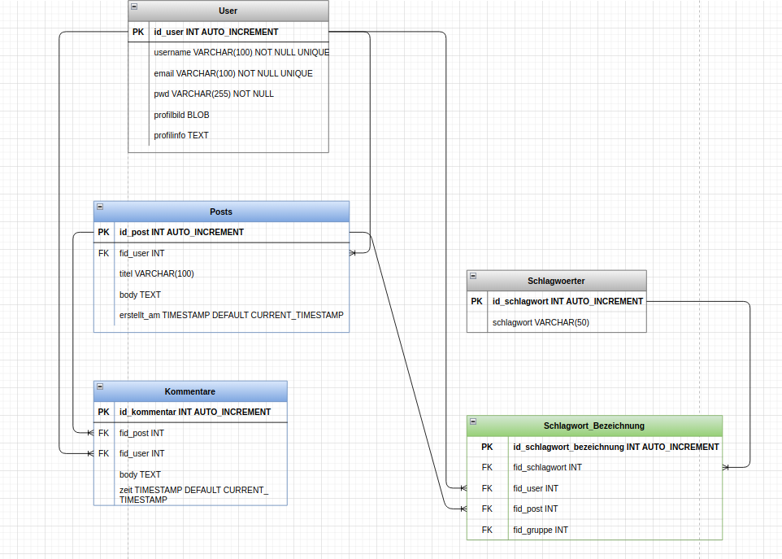

# Aufbau und Testen einer SQLite-Datenbank


Diese Übung dient dazu, die Datenbank SQLite zu benutzen, zu befüllen und Abfragen durchzuführen. Ich benutze dafür das Beispiel Social Network (in abgespeckter Form). Über Sinn und Unsinn einer SQLite-Datenbank für ein soziales Netzwerk werde ich später noch diskutieren. 

## 1. Erstellung des Datenbankmodells

Ich nehme das ERD aus dem Artivity-Projekt als Grundlage. Zur Übung specke ich es ab.



## 2. Operationen durchführen
### 2.1 SQLite-DB anlegen
Dazu öffne ich das Terminal, navigiere in den Ordner, in dem ich die Datenbank abspeichern möchte. Dort erstelle ich die DB mit folgendem Befehl:

```bash
sqlite3 ArtivityLite.db
```
### 2.2 Tabellen erstellen und füllen


Die Tabellen erstelle ich entsprechen des ERD mit folgenden Befehlen:

**users**
```sql
 CREATE TABLE users (
    id_user INTEGER PRIMARY KEY AUTOINCREMENT, 
    username VARCHAR(100) NOT NULL UNIQUE, 
    email VARCHAR(100) NOT NULL UNIQUE, 
    passwort VARCHAR(255) NOT NULL, 
    profilbild BLOB, 
    profilinfo TEXT
    );
```

Eine Datenbank ist geboren!!! Sie wird erst als Datei auf dem eigenen Rechner abgespeichert, wenn eine Tabelle angelegt ist.
Ich gebe einen Datensatz ein:
```sql
insert into users (username, email, passwort, profilbild, profilinfo) VALUES 
('martina', 'email1@emailhausen.de', 'pwd-sicher!', NULL, 'mal kieken, ob et jeht!');
```
Nachdem ich weitere Datensätze eingegeben habe, geht es weiter mit der nächsten Tabelle.

**posts**

```sql
create table posts (
id_post integer primary key autoincrement, 
fid_user integer, 
titel varchar(100), 
body text, 
erstellt_am timestamp default current_timestamp,
foreign key (fid_user) references users(id_user)
);
``` 

```sql
insert into posts(fid_user, titel, body) values(1, "Erster Post", "Willkommen bein Artivity!");
```


**kommentare**
```sql
create table kommentare (
id_kommentar integer primary key autoincrement, 
fid_post integer,
fid_user integer, 
body text, 
erstellt_am timestamp default current_timestamp,
foreign key (fid_user) references users(id_user),
foreign key (fid_post) references posts(id_post)
);
```
```sql
insert into kommentare (fid_post, fid_user, body) values
(2, 4, "Moinmoin!");
```
**schlagwoerter**

```sql
create table schlagwoerter(
id_schlagwort integer primary key autoincrement,
schlagwort varchar(50)
);
```
```sql
insert into schlagwoerter(schlagwort) values 
('Malerei'),
('Architektur'),
('Musik'),
('Mode'),
('Film');
```

**schlagwort-bezeichnung**
Diese Tabelle ist eine Hilfstabelle, um eine Many-to-Many-Beziehung aufzulösen, die sonst zwischen users und schlagwoerter bzw. posts und schlagwoerter bestanden hätte. Z. B. kann ein User mehrere Schlagwörter haben und ein Schlagwort kann von mehreren Users ausgesucht werden. 

Darum gibt es die Hilfstabelle schlagwort-bezeichnung, in der die ids der schlagwörter den ids von posts bzw. users zugeordnet werden können.

```sql 
create table schlagwort_bezeichnung(
id_schlagwort_bezeichnung integer primary key autoincrement,
fid_schlagwort integer,
fid_user integer,
fid_post integer,
foreign key(fid_schlagwort) references schlagwoerter(id_schlagwort),
foreign key(fid_user) references users(id_user),
foreign key(fid_post) references Posts(id_post)
);
```
Den users Schlagwörter zuordnen:
```sql
insert into schlagwort_bezeichnung(fid_schlagwort, fid_user) values
(2, 2),
(2, 5),
(1, 2),
(3, 3),
(4, 1),
(5, 4);
```
Den Posts Schlagwörter zuordnen:
```sql
insert into schlagwort_bezeichnung(fid_schlagwort, fid_post) values
(2, 4),
(3, 3),
(1, 2);
```

### 2.3 Abfragen

**SELECT-Abfragen Beispiele**

```sql
select * from users where profilbild is not null;
```
Gibt die Datensätze wieder, in denen ein Profilbild hinterlegt wurde.

Einen Datensatz löschen:
```sql
delete from posts where id_post = 1;
```
Einen Datensatz verändern:
```sql
update posts set body = "Ich freue mich, euch alle kennenzulernen" where id_post=2;
```

## 3. Performance-Messung

## 4. SQLite vs. SQL-Datenbank mit Server ... was ist besser für Artivity

SQLite ist in Anwendung integriert und läuft clientseitig. 
Serverseitige DB erfordert einen extra Server

SQLite | Serverbasierte DB
--- | ---
in Anwendung integriert, serverlos | erfordert extra Server
läuft direkt beim Client | Datenspeicherung auf Servern
Anwendung speichert Änderungen clientseitig, kein Zugriff durch die Anwendung auf die Daten | die Anwendung speichert die Daten auf dem Server und es erfolgt Zugriff, um z. B. online Nutzerprofile anzeigen zu können
für kleinere Anwendungen | für Anwendungen, die die Speicherung vieler Daten erfordern
wenig skalierbar, Datenbank passt in eine Datei | komplexere Datenstruktur, skalierbar
Operationen und Transaktionen laufen nacheinander | gleichzeitige Lese- und Schreibprozesse möglich
für Anwendungen, die offline laufen müssen | Server stellt die Daten rund um die Uhr zur Verfügung

**Welche Datenbank eignet sich also besser für ein Social Network?**

In diesem Fall nutze ich Artivity, um damit das Modellieren in verschiedenen Datenbanken zu üben.
Sollte ich ernsthaft ein Social Network aufsetzen wollen, wäre die serverbasierte Datenbank das richtige Modell.

Verschiedene Use-Cases liegen hier zugrunde:
- ein soziales Netzwerk muss immer online, der Server immer erreichbar sein
- die Speicherung der Daten sollte nicht lokal clientseitig erfolgen, sondern auf einem Server, damit es überhaupt möglich wird, Daten weltweit zu teilen (z. B. Userprofil, Posts, Kommentare etc.)
- eine serverbasierte Datenbank ist skalierbar, sie kann durch Sharding große Datensätze auf mehrere Server verteilen und durch das Erstellen von Replikationen sicherstellen, dass die Daten erhalten bleiben
- es muss gewähleistet sein, dass mehrere Users gleichzeitig Requests durchführen und Daten eintstellen und abrufen können
(Queue könnte man bei SQLite implementieren, die mehrere Abfragen nacheinander durchführen kann, wenn sie gleichzeitig eintreffen, das könnte aber zu Wartezeiten für die Users führen)

**Fazit**
Ich werde Artivity nur zu Übungszwecken mit einer SQLite erstellen.
Natürlich braucht ein soziales Netzwerk ein serverbasiertes Datenbanksystem.

## 5. Anbindung mit Java

Weil ich ja nicht auf das höre, was ich eben gesagt habe ... nein, natürlich tue ich das zu Übungszwecken, um eine SQLite-Datenbank mit einer Java-Programmierung zu verknüpfen.
